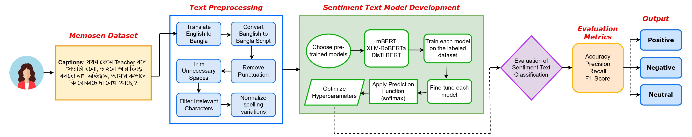
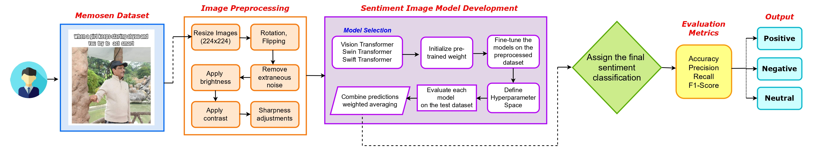

# SentimentFormer: A Transformer-Based Multi-Modal Fusion Framework for Enhanced Sentiment Analysis of Memes in Under-Resourced Bangla Language
## Abstract
Social media has increasingly relied on memes as a tool for expressing opinions, making meme sentiment analysis an emerging area of interest for researchers. While much of the research has focused on English-language memes, under-Resource languages, such as Bengali, have received limited attention. Given the surge in social media use, the need for sentiment analysis of memes in these languages has become critical. One of the primary challenges in this field is the lack of benchmark datasets, particularly in languages with fewer resources. To address this, we used the MemoSen dataset, designed for Bengali, which consists of 4,368 memes annotated with three sentiment labels: positive, negative, and neutral. MemoSen is divided into training (70%), test (20%), and validation (10%) sets, with an imbalanced class distribution: 1,349 memes in the positive class, 2,728 in the negative class, and 291 in the neutral class. Our approach leverages advanced deep learning techniques for multimodal sentiment analysis in Bengali, introducing three hybrid approaches. SentimentTextFormer is a text-based, fine-tuned model that utilizes state-of-the-art transformer architectures to accurately extract sentiment-related insights from Bengali text, capturing nuanced linguistic features. SentimentImageFormer is an image-based model that employs cutting-edge transformer-based techniques for precise sentiment classification through visual data. Lastly, SentimentFormer is a hybrid model that seamlessly integrates both text and image modalities using fusion strategies. Early Fusion combines textual and visual features at the input level, enabling the model to jointly learn from both modalities. Late Fusion merges the outputs of separate text and image models, preserving their individual strengths for the final prediction. Intermediate Fusion integrates textual and visual features at intermediate layers, refining their interactions during processing. These fusion strategies combine the strengths of both textual and visual data, enhancing sentiment analysis by exploiting complementary information from multiple sources. The performance of our models was evaluated using various accuracy metrics, with SentimentTextFormer achieving 73.31% accuracy and SentimentImageFormer attaining 64.72%. The hybrid model, SentimentFormer (SwiftFormer with mBERT), employing Intermediate Fusion, shows a notable improvement in accuracy, achieving 79.04%, outperforming SentimentTextFormer by 5.73% and SentimentImageFormer by 14.32%. Among the fusion strategies, SentimentFormer (SwiftFormer with mBERT) achieved the highest accuracy of 79.04%, highlighting the effectiveness of our fusion technique and the reliability of our multimodal framework in improving sentiment analysis accuracy across diverse modalities.

## Table of Contents
- [Proposed Methodology](#experimental-methodology)
- [Dataset Availability](#dataset-availability)
- [Result Analysis](#results-analysis)
- [Contact Information](#contact-information)
- [Citation](#citation)

## Proposed Methodology  

### Approach 1: Unimodal Sentiment Analysis Framework for Bangla Captions  
  

### Approach 2: Unimodal Sentiment Analysis Framework for Meme Images  
  

### Approach 3: Exploring Different Fusion Techniques in Multimodal Sentiment Analysis  
  


    
## Dataset Availability
In this study, we leverage the [MemoSen](https://github.com/eftekhar-hossain/MemoSen-LREC2022) dataset, a multimodal resource specifically curated for sentiment analysis in the Bengali language, to conduct our experiments. MemoSen was meticulously developed to address the lack of resources for multimodal sentiment analysis in Bengali. The dataset comprises **4,368 memes** collected from **Facebook, Twitter, and Instagram** between **February 2021 and September 2021**, using keywords such as **"Bengali Memes," "Bengali Funny Memes,"** and **"Bengali Troll Memes"** to ensure a diverse representation. The dataset includes memes with captions in **Bengali, code-mixed (Bengali and English), or Banglish (code-switched)**. During curation, memes lacking visual or textual components, containing unreadable text, or being duplicates were removed. The final dataset is annotated into three sentiment categories: **Positive, Negative, and Neutral**, following strict guidelines to ensure consistency and reduce annotation bias. For training and evaluation, the dataset is split into **train (70%), test (20%), and validation (10%)** subsets.

## Result Analysis

### Performance Metrics of Text-Based and Image-Based Models for Multimodal Sentiment Analysis of Bangla Memes

| Approach       | Model                                  | Accuracy | Precision | Recall | Weighted F1-score |
|---------------|---------------------------------------|----------|-----------|--------|-------------------|
|               | mBERT (SentimentTextFormer)          | 73.31    | 62.77     | 68.60  | 64.34             |
| Text Based    | XLM-RoBERTa                          | 72.85    | 62.38     | 68.35  | 64.03             |
|               | DistilBERT                           | 71.48    | 60.90     | 66.14  | 62.29             |
|--------------|--------------------------------------|---------|----------|-------|------------------|
|               | ViT                                  | 62.77    | 53.26     | 59.70  | 54.14             |
| Image Based   | Swin Transformer (SentimentImageFormer) | 64.72    | 53.39     | 57.39  | 54.24          |
|               | Swift Transformer                    | 63.57    | 53.90     | 59.84  | 54.79             |

### Performance Metrics for Multimodal-Based Models with Early Fusion

| Approach      | Model                                  | Accuracy | Precision | Recall | Weighted F1-score |
|--------------|---------------------------------------|----------|-----------|--------|-------------------|
|              | ViT + mBERT                           | 72.39    | 59.67     | 61.20  | 59.13             |
|              | Swin Transformer + mBERT             | 74.68    | 62.97     | 67.04  | 63.03             |
|              | Swift Transformer + mBERT            | 74.46    | 63.24     | 68.82  | 63.69             |
| Early Fusion | ViT + XLM-RoBERTa                    | 69.07    | 56.56     | 56.19  | 55.16             |
|              | Swin Transformer + XLM-RoBERTa       | 75.83    | 64.04     | 67.68  | 63.88             |
|              | Swift Transformer + XLM-RoBERTa      | 71.36    | 58.44     | 58.00  | 57.01             |
|              | ViT + DistilBERT                     | 70.45    | 58.03     | 58.40  | 56.88             |
|              | Swin Transformer + DistilBERT        | 74.68    | 62.96     | 67.58  | 63.23             |
|              | Swift Transformer + DistilBERT       | 71.82    | 59.50     | 60.61  | 58.56             |

### Performance Metrics for Multimodal-Based Models with Late Fusion

| Approach     | Model                                  | Accuracy | Precision | Recall | Weighted F1-score |
|-------------|---------------------------------------|----------|-----------|--------|-------------------|
|             | ViT + mBERT                           | 61.28    | 48.78     | 48.05  | 47.63             |
|             | Swin Transformer + mBERT             | 71.02    | 56.60     | 56.97  | 56.09             |
|             | Swift Transformer + mBERT            | 67.35    | 53.93     | 54.78  | 52.81             |
| Late Fusion | ViT + XLM-RoBERTa                    | 62.43    | 49.66     | 48.84  | 48.49             |
|             | Swin Transformer + XLM-RoBERTa       | 74.80    | 60.38     | 60.97  | 59.82             |
|             | Swift Transformer + XLM-RoBERTa      | 62.77    | 49.61     | 50.10  | 49.02             |
|             | ViT + DistilBERT                     | 69.87    | 55.69     | 56.33  | 55.28             |
|             | Swin Transformer + DistilBERT        | 65.29    | 52.94     | 53.25  | 51.98             |
|             | Swift Transformer + DistilBERT       | 68.73    | 55.04     | 56.23  | 54.68             |

### Performance Metrics for Multimodal-Based Models with Intermediate Fusion

| Approach       | Model                                  | Accuracy | Precision | Recall | Weighted F1-score |
|---------------|---------------------------------------|----------|-----------|--------|-------------------|
|               | ViT + mBERT                           | 68.16    | 57.83     | 63.45  | 58.40             |
|               | Swin Transformer + mBERT             | 68.73    | 59.80     | 68.08  | 60.43             |
|               | Swift Transformer + mBERT (SentimentFormer) | 79.04 | 71.29 | 77.42  | 73.28             |
| Intermediate  | ViT + XLM-RoBERTa                    | 66.44    | 56.69     | 62.23  | 56.94             |
| Fusion       | Swin Transformer + XLM-RoBERTa       | 72.16    | 62.85     | 70.52  | 63.17             |
|               | Swift Transformer + XLM-RoBERTa      | 74.46    | 65.12     | 71.79  | 64.84             |
|               | ViT + DistilBERT                     | 66.44    | 56.35     | 61.70  | 56.53             |
|               | Swin Transformer + DistilBERT        | 71.02    | 61.84     | 69.35  | 62.30             |


## Contact Information

For any questions, collaboration opportunities, or further inquiries, please feel free to reach out:

- **Fatema Tuj Johora Faria**
  - Email: [fatema.faria142@gmail.com](mailto:fatema.faria142@gmail.com)

    
## Citation

If you find the dataset or the associated research work helpful, please consider citing our paper:

```bibtex
@article{202501.1587,
	doi = {10.20944/preprints202501.1587.v1},
	url = {https://doi.org/10.20944/preprints202501.1587.v1},
	year = 2025,
	month = {January},
	publisher = {Preprints},
	author = {Fatema Tuj Johora Faria and Laith H. Baniata and Mohammad H. Baniata and Mohannad A. Khair and Ahmed Ibrahim Bani Ata and Chayut Bunterngchit and Sangwoo Kang},
	title = {SentimentFormer: A Transformer-Based Multi-Modal Fusion Framework for Enhanced Sentiment Analysis of Memes in Under-Resourced Bangla Language},
	journal = {Preprints}
}

